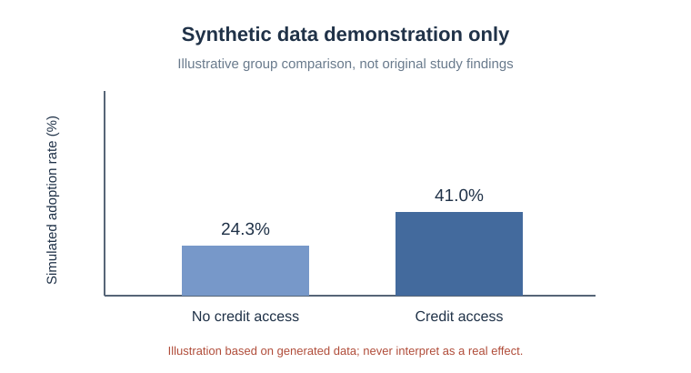

# 信贷可得性与农业技术采纳：农户问卷研究与可复现分析

**Credit Access & Agricultural Technology Adoption — Survey Research and Reproducible Analysis**

> 本仓库基于真实参与的国家级大学生创新训练项目整理。原研究涉及 **428 份有效农户问卷、Stata 与 ESP 模型**；仓库中的 Python 代码是在作品整理阶段新编写的分析演示，使用 **320 条完全模拟的数据**。两者严格区分。

## 项目概况

| 项目 | 内容 |
| --- | --- |
| 研究主题 | 信贷可得性对水稻种植户采用水肥一体化技术的影响 |
| 项目类别 | 国家级大学生创新训练项目（2023.03—2024.05） |
| 实际参与 | 问卷整理与核验、变量构建、Stata/ESP 定量分析及结果解释 |
| 研究问题 | 农户获得信贷的条件与农业技术采纳决策之间有何关系？ |
| 仓库用途 | 展示数据质量检查、描述性统计、分组比较、Logit 方法演示与敏感性检查 |

水肥一体化技术涉及设备投入、经营条件与管理知识。研究关注信贷可得性，同时考虑耕作面积、教育程度、培训与成本感知等因素。原研究采用 ESP（内生转换 Probit）方法；**此处的普通 Logit 演示不能替代原研究模型，更不代表其因果识别结果。**

## 分析流程

```text
模拟数据生成
    ↓
字段/唯一性/取值范围检查
    ↓
缺失值审计与演示性处理
    ↓
描述统计与信贷分组比较
    ↓
二元 Logit 示例 + 完整样本敏感性检查
    ↓
演示性结果与图表
```

## 演示结果（全部基于模拟数据）



- [研究设计和变量说明](docs/research_design.md)
- [数据质量检查方案](docs/data_quality.md)
- [从研究问题到行为洞察](docs/insight_to_action.md)
- [模拟结果摘要](outputs/demo_summary.md)

## 在本地运行

需要 Python 3.10+：

```bash
python -m pip install -r requirements.txt
python src/generate_demo_data.py
python src/analyze_demo.py
python -m pytest -q
```

分析代码输出审计报告、描述性统计表、模拟模型系数与 PNG 图表到 `outputs/`。

## 文件结构

```text
README.md
requirements.txt
docs/
  research_design.md
  data_quality.md
  insight_to_action.md
src/
  generate_demo_data.py
  analyze_demo.py
tests/
  test_pipeline.py
data/
  README.md
outputs/
  demo_group_comparison.svg
  demo_summary.md
  README.md
```

## 数据与成果边界

- 本仓库不包含原始问卷、农户个人信息或原研究模型结果。
- 演示脚本随机生成 **320** 条数据；与实际项目的 **428** 份有效问卷刻意区分。
- 演示数值、图表与显著性均由模拟机制产生，**不是原项目研究发现**，不能用于推断实际信贷政策效果。
- 演示 Python 代码为作品整理阶段追加编写，**不是原项目当时使用的代码**。

本仓库无署名及个人联系方式。
